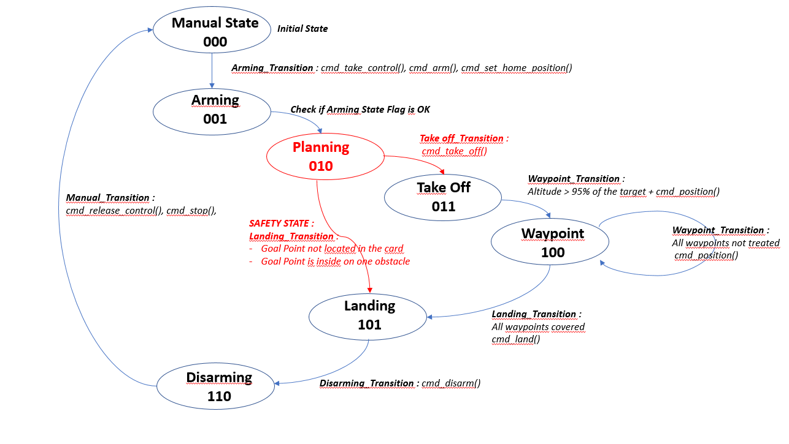
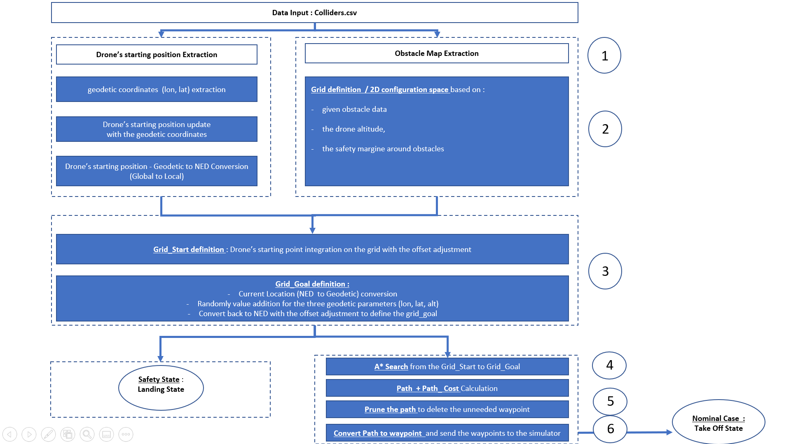
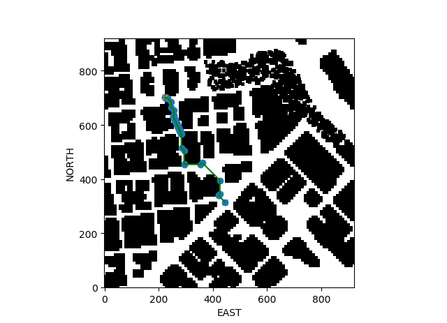
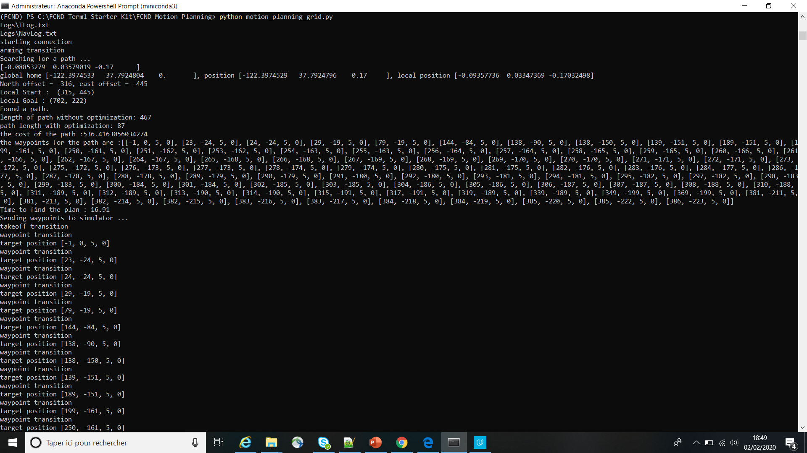

## 3D Motion Planning (Grid)
---------------------
#### Results visualization with the simulator [here](https://github.com/Jeanyvesbourdoncle/FCND-Motion-Planning/blob/master/Results/2020-02-02_19-41-16.mp4).


---------------------
### Target
The target of this project is to plan a path through an urban environment between a start and a goal location using the A* algorithm. 

A finite state machine using event-driven programming will be used for autonomously flying a drone. 
 
The communication with the drone is done using MAVLink.

----------------------
### Detailed Requirements

Autonomous control will be done using an event-driven state machine. 
Each callback function checks against transition criteria dependent on the current state. If the transition criteria are met, it will transition to the next state and pass along any required commands to the drone.

Design of the SW pipeline:

- 2.5D map download in the `colliders.csv` file describing the environment.
- Environment discretization into a grid representation.
- Start and goal locations definition. 
- Perform a search using A* algorithm.
- Perform the collinearity test to remove unnecessary waypoints.
- Waypoints in local ECEF coordinates ([N, E, altitude, heading] format). 

-----------------------
### Part 1 : Environment Installation

#### Step 1: Download the Simulator
Download the Motion-Planning simulator for this project that's appropriate for your operating system from the [simulator releases respository](https://github.com/udacity/FCND-Simulator-Releases/releases).

#### Step 2: Set up your Python Environment
If you haven't already, set up your Python environment and get all the relevant packages installed using Anaconda following instructions in [this repository](https://github.com/udacity/FCND-Term1-Starter-Kit)

#### Step 3: Clone this Repository
```sh
git clone https://github.com/udacity/FCND-Motion-Planning
```

#### Step 4: Inspect the relevant files
The file `colliders.csv` contains the 2.5D map of the simulator environment. 

#### Step 5: Python environment + run the programm
First start up the simulator, then at the command line:
 
```sh
source activate fcnd # if you haven't already sourced your Python environment, do so now.
python motion_planning_grid.py
```

--------------------------------
### Part 2.1 : SW architecture

##### `planning_utils_grid.py`
The planning_utils.py delivers the python function useful for the motion planning :

- Class Action : valid movement actions that can take the drone from the current position.
An action is represented by a 3 element tuple :
	- the two first values are the delta of the action relative to the current grid position (N/E/S/W). 
	- the third value is the cost of performing the action.
- Valid_actions : deliver the list of valid actions given a grid and current node.
- A_star : Algorithm, which calculate the path from the start point to the goal point.
- Heuristic : calculation of the euclidean distance (and the Manhattan distance) between a start point and a goal point.
- Create_grid : 2D configuration space based on given obstacle data, drone altitude and safety distance arguments.
- Point : 3D point implementation in a array.
- Collinearity check : determinant calculation of a matrix containing the points. If the determinant is less that the epsilon threshold, then the points are collinear.
- Prune_path : deletion of the unneeded waypoints. Use of the collinearity_check to know if the points are in the in a linear line.   
- Plot_route : visualization of the start point, the goal point and the waypoints. The function is called before and after the prune activity.

##### `motion_planning_grid.py` 
The motion_planning.py is the implementation of the Motion Planning algorithm. The grid search and the A* algorithm will be used. 

###### Class
These two classes are already implemented in the last project FCND-Backyard-Flyer, with a simple rectangular route without obstacle.  
- States Class : Flight states implemented in the finite State Machine  
- MotionPlanning Class : Main class of the programm. The code is implemented in this function.


###### Finite State Machine Design
The basic functions (transition and callback fonction) present in the finite State Machine (asynchronous graph) are in the picture below:
<p align="center">

</p> 

The state named "PLANNING" has been added between the state "ARMING" and "TAKEOFF".

##### Plan_path (implemented in the main class)
The SW Pipeline of the state "PLANNING" with his function Plan_Path is here documented :

1- Load the 2.5D Map
2- Environment discretization
3- Start and Goal localization
4- A* Search algorithm
5- Collinearity test to remove unnecessary waypoints
6- Convert Path to waypoints

<p align="center">

</p> 


--------------------------------
### Part 2.2 : Results

The results are presented here :

#### Path before the pruned step :
<p align="center">

</p> 


#### Path after the pruned step :
<p align="center">

</p> 


#### Diagnostic information :
The diagnostic informations are :
	1- the local start and goal + the north and the east offset
	2- the cost for the path,
	3- the lenght of the path and the lenght of the prunned path,
	4- the time to provide the path,
	5- waypoints coordinate with the format [N, E, altitude, heading]
	
<p align="center">

</p> 
